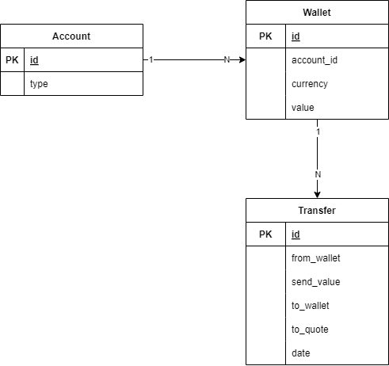

# International Money Transfer

Esse projeto tem a finalidade de simular as regras para transferências internais de dinheiro (câmbio), juntamente com um desafio para mostrar habilidades e regras de negócio.

## Regras

- Cadastro de contas bancárias
  - Deve ter uma carteira em real e em dolar
  - As contas devem transacionar entre sí
  - Pode ser pessoa física (PF) ou pessoa jurídica (PJ)
- Transferências
  - Se for uma transferência de câmbio temos limite diário de $8.000
  - Devem considerar a cotação atual do dolar
  - Se for fim de semana, deve-se considerar do último dia da semana

## Diagrama

## Todo
- [ ] Implementar value objects no Domain
  - [ ] Cuidado com precisão do BigDecimal